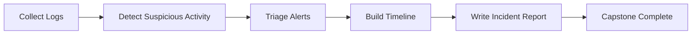

<div align="center">

# 🛡️ 01 Cyber Range Blue Team

### Beginner-to-advanced blue-team cyber defense lab for local, authorized training.


[🚀 Quick Start](#-quick-start) • [🧪 Labs](#-hands-on-labs) • [📊 Detections](#-detection-engineering) • [📝 Capstone](#-final-capstone) • [📁 Structure](#-project-structure)

</div>

---

## 📌 Project Overview

`01-cyber-range-blue-team` is a self-contained cyber defense training range for learning log analysis, alert triage, detection engineering, timeline building, and incident response reporting.

> This project uses sample logs and harmless simulated events only. It does not include malware, credential theft, persistence tooling, exploit code, or instructions for attacking real systems.

---

## 🎯 Mission Flow



---

## 🧠 Skills Learned

| Skill Area | What You Practice |
|---|---|
| Linux Log Review | Read auth, syslog, and service logs |
| Failed Login Detection | Identify repeated authentication failures |
| Web Log Analysis | Review suspicious paths, status codes, and source activity |
| Detection Engineering | Build Sigma-style rules, Python scripts, Bash one-liners, and JSON alerts |
| Alert Triage | Prioritize events by severity, confidence, and scope |
| Incident Response | Build timelines and write professional reports |

---

## 🧭 Difficulty Levels

| Level | Marker | Description |
|---|---:|---|
| Beginner | 🟢 | Guided log review and simple detections |
| Intermediate | 🟡 | Pattern recognition, correlation, and alert triage |
| Advanced | 🔴 | Multi-source investigation and final report writing |

---

## 🖼️ Screenshots Placeholder

| Dashboard | Alerts | Timeline |
|---|---|---|
| `assets/screenshots/dashboard.png` | `assets/screenshots/alerts.png` | `assets/screenshots/timeline.png` |
| Add screenshot | Add screenshot | Add screenshot |

---

## 🚀 Quick Start

```powershell
git clone https://github.com/m4ckDev/01-cyber-range-blue-team.git
cd 01-cyber-range-blue-team
docker compose -f .\docker\docker-compose.yml up --build -d
python .\scripts\run_all_detections.py
```

Stop the lab:

```powershell
docker compose -f .\docker\docker-compose.yml down
```

---

## 📁 Project Structure

```text
01-cyber-range-blue-team/
├── assets/
├── detections/
│   ├── bash/
│   ├── json-alerts/
│   ├── python/
│   └── sigma/
├── docker/
├── docs/
├── labs/
├── reports/
├── sample-logs/
├── scripts/
├── LEARNING_PATH.md
├── README.md
├── REPORT_TEMPLATE.md
└── SECURITY.md
```

---

## 🧪 Hands-On Labs

| # | Lab | Difficulty | Outcome |
|---:|---|---|---|
| 01 | Linux Log Review | 🟢 | Understand common Linux security logs |
| 02 | Failed Login Detection | 🟢 | Detect repeated login failures |
| 03 | Suspicious Process Detection | 🟡 | Identify unusual process activity |
| 04 | Web Attack Log Analysis | 🟡 | Review suspicious web requests |
| 05 | Brute-Force Pattern Recognition | 🟡 | Recognize repeated access attempts |
| 06 | File Integrity Monitoring | 🟡 | Compare baselines and changed files |
| 07 | Network Connection Review | 🟡 | Review simulated connection logs |
| 08 | Incident Timeline Building | 🔴 | Build a chronological event timeline |
| 09 | Alert Triage | 🔴 | Prioritize and classify alerts |
| 10 | Final Capstone Investigation | 🔴 | Complete a full incident report |

---

## 📊 Detection Engineering

| Detection Type | Location | Purpose |
|---|---|---|
| Sigma-style rules | `detections/sigma/` | Portable detection logic examples |
| Python scripts | `detections/python/` | Simple parsing and alert generation |
| Bash one-liners | `detections/bash/` | Quick command-line analysis |
| JSON alerts | `detections/json-alerts/` | Example SOC-style alert output |

---

## 📝 Final Capstone

The capstone requires the student to investigate simulated logs, identify what happened, build a timeline, classify alerts, and complete an incident response report.

| Deliverable | File |
|---|---|
| Investigation notes | `reports/capstone-notes.md` |
| Incident timeline | `reports/capstone-timeline.md` |
| Final report | `reports/final-incident-report.md` |
| Report template | `REPORT_TEMPLATE.md` |

---

## ✅ Lab Completion Checklist

- [ ] Lab 01 complete
- [ ] Lab 02 complete
- [ ] Lab 03 complete
- [ ] Lab 04 complete
- [ ] Lab 05 complete
- [ ] Lab 06 complete
- [ ] Lab 07 complete
- [ ] Lab 08 complete
- [ ] Lab 09 complete
- [ ] Lab 10 complete
- [ ] Final incident report written
- [ ] Detection outputs reviewed
- [ ] Lessons learned documented

---

## 🧩 Expandable Lab Menu

<details>
<summary><strong>🟢 Beginner Labs</strong></summary>

- Lab 01: Linux Log Review
- Lab 02: Failed Login Detection

</details>

<details>
<summary><strong>🟡 Intermediate Labs</strong></summary>

- Lab 03: Suspicious Process Detection
- Lab 04: Web Attack Log Analysis
- Lab 05: Brute-Force Pattern Recognition
- Lab 06: File Integrity Monitoring
- Lab 07: Network Connection Review

</details>

<details>
<summary><strong>🔴 Advanced Labs</strong></summary>

- Lab 08: Incident Timeline Building
- Lab 09: Alert Triage
- Lab 10: Final Capstone Investigation

</details>

---

## 🛡️ Authorized Use Disclaimer

This project is for authorized local lab training only. Do not use this project, its examples, or its techniques against systems you do not own or do not have explicit permission to test.

This repository contains simulated logs, defensive examples, and safe local training material only.

<div align="center">


</div>
